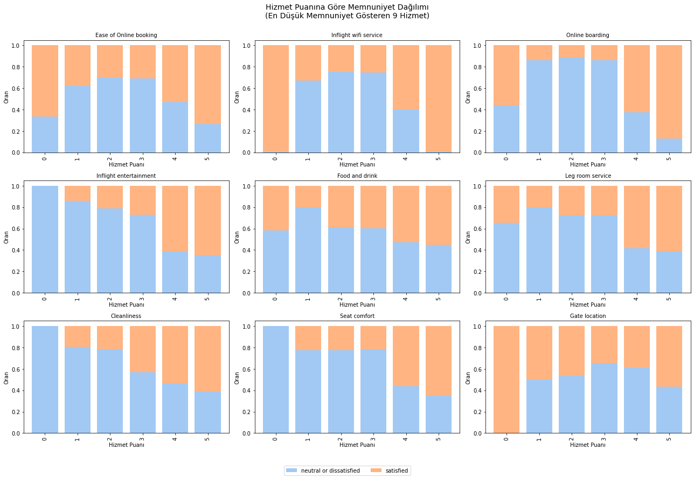
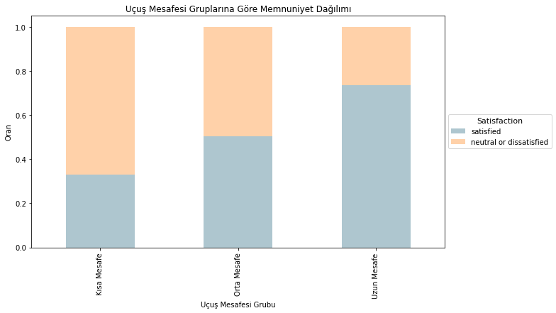

# Havayolu Yolcu Memnuniyeti Analizi

Bu proje, [Patika.dev - Kız Başına Veri Analizi Bootcamp](https://www.patika.dev/) kapsamında gerçekleştirilmiştir.  
Kaggle üzerinde yer alan **Airline Passenger Satisfaction** veri seti kullanılarak Python ile veri analizi yapılmıştır.

📂 **Veri Seti**: [Airline Passenger Satisfaction – Kaggle](https://www.kaggle.com/datasets/teejmahal20/airline-passenger-satisfaction)

---

## 🔍 Amaç

- Müşteri memnuniyetini etkileyen faktörleri belirlemek  
- Aykırı değerleri tespit etmek ve yorumlamak  
- Segmentasyon yaparak öne çıkan yolcu gruplarını analiz etmek  
- Düşük memnuniyet alan hizmetleri görselleştirerek içgörü elde etmek

---

## 🧰 Kullanılan Teknolojiler

- Python
- Pandas, NumPy
- Matplotlib, Seaborn
- Jupyter Notebook

---

## 📊 Örnek Görseller

### Hizmet Puanına Göre Memnuniyet Dağılımı  

### Uçuş Mesafesine Göre Memnuniyet  

### Hedef Segmentte Düşük Puanlı Alanlar  

